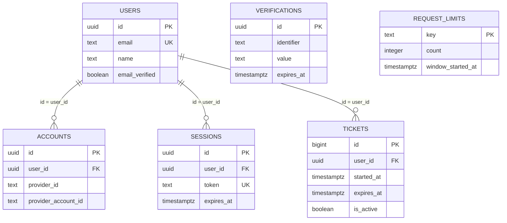
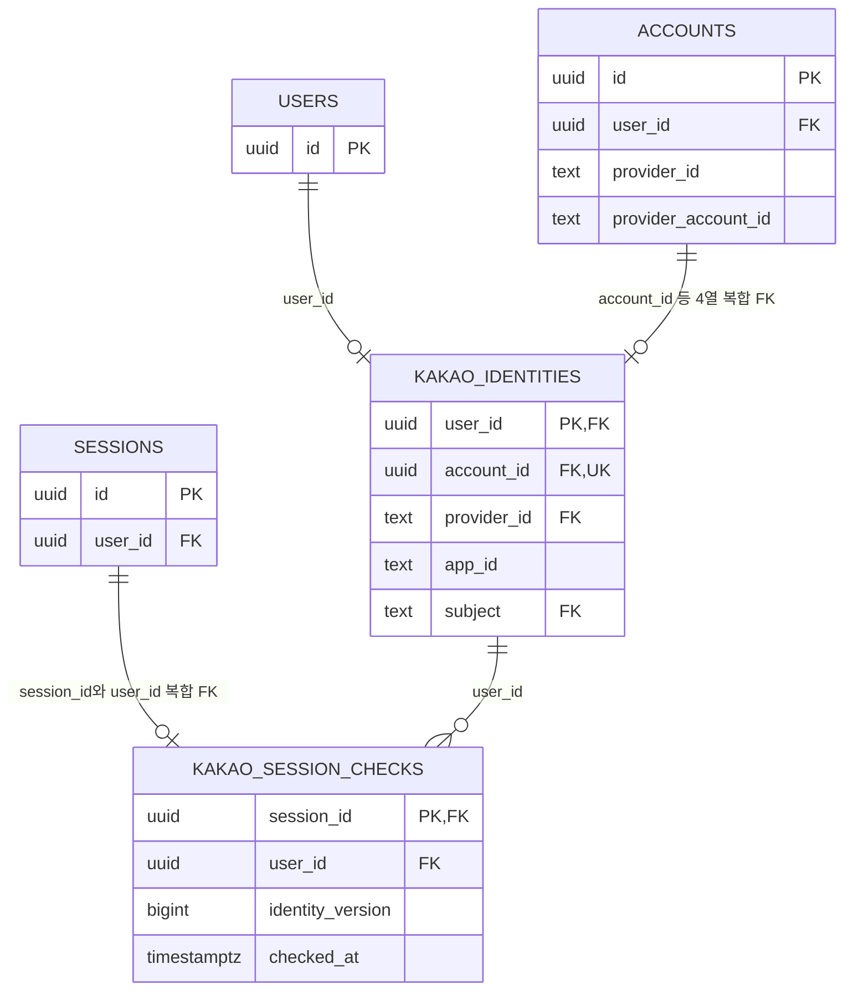
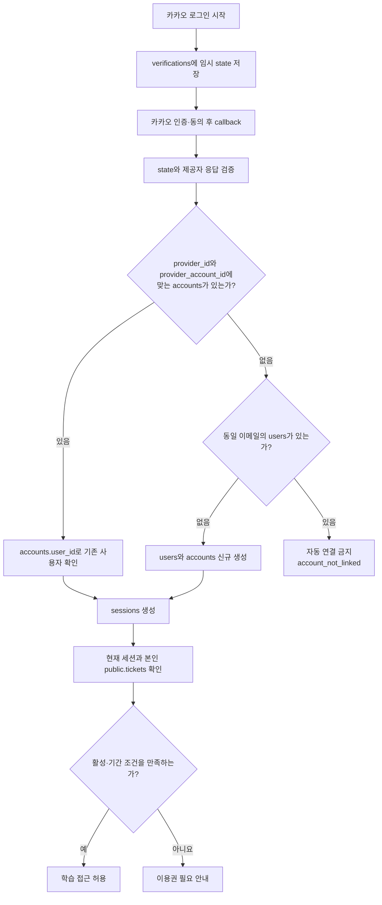

# Better Auth 테이블·필드·관계 안내

`better_auth`는 인증 자료를 모아 둔 **PostgreSQL 스키마**다. 이 문서는 2026-09-14 운영 DB의 테이블·열·외래 키·인덱스·RLS를 읽기 전용으로 조회하고, Better Auth 1.7.4를 사용하는 현재 코드와 대조한 결과를 설명한다. 실제 사용자 ID·이메일·토큰·행 데이터는 포함하지 않는다.

범위는 `better_auth`의 **7개 테이블, 46개 필드 전체**와 사용자에게 이용권을 연결하는 `public.tickets`의 **7개 필드**다. 초기 migration에는 이후 제거된 전화번호 열이 있으므로, 현재 구조는 이름 변경 migration과 수동 폐기 SQL까지 반영한 상태를 기준으로 읽는다.

## 1. 먼저 이해할 구조

사용자가 카카오로 인증하면 `accounts`가 카카오 회원과 서비스 사용자를 연결하고, `users`가 서비스 안에서 그 사람의 기준 ID가 된다. 로그인 성공 후에는 `sessions`가 현재 로그인 상태를 기록한다. 학습 접근은 그 사용자에게 연결된 `public.tickets`의 활성 여부와 기간으로 판단한다.

| 구분                    | 테이블                             | 맡는 일                                                 | 현재 사용                                                          |
| ----------------------- | ---------------------------------- | ------------------------------------------------------- | ------------------------------------------------------------------ |
| 사용자                  | `better_auth.users`                | 이름·이메일과 서비스 사용자 UUID                        | 가입·로그인·프로필의 기준                                          |
| 외부 계정               | `better_auth.accounts`             | 카카오 회원 식별자와 사용자 UUID 연결, 제공자 토큰 보관 | 카카오 로그인                                                      |
| 로그인 상태             | `better_auth.sessions`             | 사용자별 로그인 세션·만료 시각                          | 세션 확인·로그아웃·학습 접근                                       |
| 임시 인증 자료          | `better_auth.verifications`        | OAuth 요청을 확인하는 state 등 유효기간이 있는 값       | 로그인 시작과 callback 처리                                        |
| 요청 제한               | `better_auth.request_limits`       | 서버 인스턴스들이 공유하는 요청 횟수                    | 로그인·서비스 API 호출 제한                                        |
| 과거 식별 출처          | `better_auth.kakao_identities`     | 카카오 앱 ID·회원 식별자와 계정의 결합                  | 구조를 보존하며 현행 인증 경로에서는 읽거나 쓰지 않음              |
| 과거 전화번호 확인 이력 | `better_auth.kakao_session_checks` | 세션별 과거 식별 정보 확인 버전                         | 기능 종료 후 구조를 보존하며 현행 인증 경로에서는 읽거나 쓰지 않음 |
| 이용권                  | `public.tickets`                   | 사용자별 이용 가능 기간·활성 상태                       | 유효 세션 확인 후 학습 권한 판정                                   |

### 1.1 세 종류의 ID

| 이름             | 실제 필드                      | 의미                                                                                                              |
| ---------------- | ------------------------------ | ----------------------------------------------------------------------------------------------------------------- |
| 서비스 사용자 ID | `users.id`                     | 서비스 안에서 사람을 가리키는 UUID. `accounts.user_id`, `sessions.user_id`, `tickets.user_id`가 이 값을 참조한다. |
| 서비스 계정 ID   | `accounts.id`                  | 서비스 안에서 외부 계정 연결 한 건을 가리키는 UUID. `kakao_identities.account_id`가 이 값을 참조한다.             |
| 제공자 회원 ID   | `accounts.provider_account_id` | 카카오가 반환한 회원 식별자. 문자열이며 서비스 UUID와 별개다.                                                     |

Better Auth API의 `accountId`는 DB의 **`accounts.provider_account_id`**에 매핑된다. 이전 이름인 `accounts.account_id`는 변경됐다. 반면 **`kakao_identities.account_id`는 계정 UUID를 참조하므로 그대로 남아 있다.** 테이블을 생략하고 `account_id`만 보고 의미를 판단하지 않는다.

## 2. 구조도와 외래 키

### 2.1 현재 로그인과 이용권 구조

아래 ERD는 관계를 읽기 쉽도록 주요 필드만 표시한다. 전체 필드는 3~5절에 있다. `||`는 정확히 하나, `o{`는 0개 이상을 뜻한다. 예를 들어 사용자 한 명은 로그인 세션과 이용권을 각각 여러 개 가질 수 있지만, 세션·이용권 한 행의 소유자는 한 명이다.



`TICKETS`는 `public.tickets`이며 나머지는 `better_auth` 테이블이다. `verifications`와 `request_limits`에는 사용자 외래 키가 없다. 임시 인증 값이나 요청 제한 이름을 사용하며, ERD에도 사용자와의 관계선을 만들지 않았다. `accounts`와 `sessions`는 각각 `users`를 참조하고 서로를 직접 참조하지 않는다.

### 2.2 보존 중인 과거 구조

이 관계들은 현재도 DB 제약으로 존재한다. `o|`는 0개 또는 하나를 뜻한다. 정상적인 신규 가입에서 아래 두 과거 테이블의 행을 만들 필요는 없다.



복합 FK는 여러 열의 **조합 전체**가 같은 부모 행과 일치해야 한다는 뜻이다. 그림의 FK 표시는 아래 표의 조합을 함께 읽는다.

| 자식의 참조 열                                                 | 부모의 대상 열                                             | 부모 한 행당 자식 수 | 부모 삭제 시                                      |
| -------------------------------------------------------------- | ---------------------------------------------------------- | -------------------- | ------------------------------------------------- |
| `accounts.user_id`                                             | `users.id`                                                 | 0개 이상             | `CASCADE` — 연결된 계정도 삭제                    |
| `sessions.user_id`                                             | `users.id`                                                 | 0개 이상             | `CASCADE` — 연결된 세션도 삭제                    |
| `kakao_identities.user_id`                                     | `users.id`                                                 | 0개 또는 하나        | `CASCADE`                                         |
| `kakao_identities.(account_id, user_id, provider_id, subject)` | `accounts.(id, user_id, provider_id, provider_account_id)` | 0개 또는 하나        | `CASCADE`                                         |
| `kakao_session_checks.(session_id, user_id)`                   | `sessions.(id, user_id)`                                   | 0개 또는 하나        | `CASCADE`                                         |
| `kakao_session_checks.user_id`                                 | `kakao_identities.user_id`                                 | 0개 이상             | `CASCADE`                                         |
| `public.tickets.user_id`                                       | `users.id`                                                 | 0개 이상             | `RESTRICT` — 이용권이 참조하는 사용자 삭제를 거부 |

사용자 삭제가 이용권 FK에 걸리면 해당 삭제문은 실패한다. 별도의 명령으로 먼저 지운 계정·세션까지 자동으로 복원되는 것은 아니다. 관련 자료를 따로 삭제하다가 사용자만 남으면 로그인 연결이 끊길 수 있다.

## 3. Better Auth 기본 테이블의 모든 필드

표의 **NULL 허용**은 DB 열이 빈 값을 허용하는지를 뜻한다. **기본값 없음**은 값을 생략해도 된다는 뜻이 아니다. NOT NULL이면서 기본값이 없는 필드는 저장하는 코드가 값을 제공해야 한다. `timestamptz`는 시점을 저장하며 조회 연결의 시간대에 따라 표시가 달라진다. `updated_at`은 이름만으로 자동 갱신되지 않는다. 확인한 테이블에는 자동 갱신용 사용자 정의 트리거가 없다.

### 3.1 `better_auth.users` — 서비스 사용자

이 테이블의 한 행이 서비스 사용자 한 명이다. 카카오 로그인 이후의 프로필과 세션·이용권 소유권이 모두 `id`를 기준으로 연결된다.

| 필드             | DB 타입       | NULL 허용 | DB 기본값           | 설명·제약                                                                                                    |
| ---------------- | ------------- | --------- | ------------------- | ------------------------------------------------------------------------------------------------------------ |
| `id`             | `uuid`        | 아니요    | `gen_random_uuid()` | 사용자 PK. 인증 코드도 UUID를 생성하도록 설정돼 있다.                                                        |
| `name`           | `text`        | 아니요    | 없음                | 표시 이름. 현재는 카카오 프로필의 닉네임을 사용한다.                                                         |
| `email`          | `text`        | 아니요    | 없음                | 사용자 이메일. UNIQUE이며 동일한 저장값의 중복을 거부한다. 이메일이 같아도 외부 계정을 자동 연결하지 않는다. |
| `email_verified` | `boolean`     | 아니요    | 없음                | 이메일 확인 여부. 카카오 응답의 이메일 유효·인증 상태를 모두 확인해 설정한다.                                |
| `image`          | `text`        | 예        | 없음                | 제공된 프로필 이미지 URL. 이미지가 없으면 NULL일 수 있다.                                                    |
| `created_at`     | `timestamptz` | 아니요    | `CURRENT_TIMESTAMP` | 사용자 생성 시각.                                                                                            |
| `updated_at`     | `timestamptz` | 아니요    | `CURRENT_TIMESTAMP` | 사용자 정보 갱신 시각. 이후 갱신은 인증 코드가 처리한다.                                                     |

`email`의 DB 제약은 일반 `text` UNIQUE다. 별도의 대소문자 무시 인덱스는 없다. 현재 Better Auth의 OAuth 처리는 이메일을 소문자로 정규화하지만, DB에서 직접 쓰는 값까지 이 규칙이 자동 적용되지는 않는다.

### 3.2 `better_auth.accounts` — 외부 로그인 계정

`provider_id`와 `provider_account_id`로 외부 계정을 찾고, `user_id`로 서비스 사용자에게 연결한다. DB 구조는 사용자 한 명에게 여러 외부 계정을 연결할 수 있지만, 현재 서비스는 카카오 로그인만 허용하고 자동 계정 연결을 꺼 두었다.

| 필드                       | DB 타입       | NULL 허용 | DB 기본값           | 설명·제약                                                                                                                                   |
| -------------------------- | ------------- | --------- | ------------------- | ------------------------------------------------------------------------------------------------------------------------------------------- |
| `id`                       | `uuid`        | 아니요    | `gen_random_uuid()` | 계정 연결 한 건의 내부 PK. 카카오 회원 식별자와 구분한다.                                                                                   |
| `provider_account_id`      | `text`        | 아니요    | 없음                | 카카오 등 제공자가 반환한 회원 식별자. Better Auth의 `accountId`가 여기에 저장된다.                                                         |
| `provider_id`              | `text`        | 아니요    | 없음                | 제공자 이름. 현재 인증 경로에서는 `kakao`를 사용하며 이 열 자체에 카카오 전용 CHECK는 없다.                                                 |
| `user_id`                  | `uuid`        | 아니요    | 없음                | `users.id`를 참조하는 FK. 계정의 서비스 소유자.                                                                                             |
| `access_token`             | `text`        | 예        | 없음                | 제공자 API 접근 토큰. 현재 설정은 Better Auth가 암호화한 값을 저장한다.                                                                     |
| `refresh_token`            | `text`        | 예        | 없음                | 제공자 접근 토큰 갱신용 토큰. 현재 설정은 암호화 저장한다. 제공자가 주지 않을 수 있다.                                                      |
| `id_token`                 | `text`        | 예        | 없음                | 제공자가 반환하는 ID 토큰 보관 열. 현재 요청은 `openid` scope를 추가하지 않는다. 모든 토큰 열이 같은 방식으로 암호화된다고 가정하지 않는다. |
| `access_token_expires_at`  | `timestamptz` | 예        | 없음                | 제공자 접근 토큰의 만료 시각. 서비스 세션 만료와 별개다.                                                                                    |
| `refresh_token_expires_at` | `timestamptz` | 예        | 없음                | 제공자 갱신 토큰의 만료 시각. 응답에 없으면 NULL일 수 있다.                                                                                 |
| `scope`                    | `text`        | 예        | 없음                | 제공자가 승인한 접근 범위. 현재 요청 범위는 `account_email`, `profile_nickname`이다.                                                        |
| `password`                 | `text`        | 예        | 없음                | Better Auth의 비밀번호 인증용 공통 열. 현재 카카오 전용 흐름은 이 필드를 사용하지 않는다.                                                   |
| `created_at`               | `timestamptz` | 아니요    | `CURRENT_TIMESTAMP` | 계정 연결 생성 시각.                                                                                                                        |
| `updated_at`               | `timestamptz` | 아니요    | 없음                | 계정·토큰 갱신 시각. 저장 시 코드가 제공해야 한다.                                                                                          |

유일성은 `UNIQUE(provider_id, provider_account_id)`로 보장한다. 같은 제공자 회원을 중복 연결할 수 없다. 추가로 `UNIQUE(id, user_id, provider_id, provider_account_id)`가 과거 식별 출처의 복합 FK를 받는다. `user_id`에는 계정 조회용 인덱스가 있다.

카카오 앱을 교체할 때는 앱별 회원 식별자가 같은지 별도로 확인해야 한다. `accounts`에는 `app_id`가 없고, 과거 앱 출처를 담는 곳은 `kakao_identities`다. 이메일만으로 이전 앱의 계정과 새 앱의 계정을 동일하게 취급하지 않는다.

### 3.3 `better_auth.sessions` — 로그인 세션

세션 한 행은 사용자의 로그인 상태 한 건이다. 한 사용자가 여러 기기·브라우저에서 로그인하면 여러 행이 생길 수 있다. 현재 세션 유효기간 설정은 1시간이며 쿠키의 세션 정보 캐시는 꺼져 있다.

| 필드         | DB 타입       | NULL 허용 | DB 기본값           | 설명·제약                                                                       |
| ------------ | ------------- | --------- | ------------------- | ------------------------------------------------------------------------------- |
| `id`         | `uuid`        | 아니요    | `gen_random_uuid()` | 세션 PK. 학습 API용 JWT의 `session_id`와 대조한다.                              |
| `user_id`    | `uuid`        | 아니요    | 없음                | `users.id`를 참조하는 FK. 세션 소유자.                                          |
| `token`      | `text`        | 아니요    | 없음                | 세션을 식별하는 인증용 비밀값. UNIQUE이며 카카오 토큰과 별개다.                 |
| `expires_at` | `timestamptz` | 아니요    | 없음                | 서비스 세션 만료 시각. 만료되거나 행이 삭제되면 그 세션으로 접근할 수 없다.     |
| `ip_address` | `text`        | 예        | 없음                | IP 기록용 공통 열. 현재 설정은 IP 추적을 끄므로 신규 IP 수집에 사용하지 않는다. |
| `user_agent` | `text`        | 예        | 없음                | 요청이 제공한 브라우저·클라이언트 정보.                                         |
| `created_at` | `timestamptz` | 아니요    | `CURRENT_TIMESTAMP` | 세션 생성 시각.                                                                 |
| `updated_at` | `timestamptz` | 아니요    | 없음                | 세션 갱신 시각. 저장 시 코드가 제공해야 한다.                                   |

`UNIQUE(id, user_id)`는 과거 세션 확인 이력의 복합 FK를 받는다. `user_id`와 `expires_at`에 각각 인덱스가 있다. 세션·OAuth 토큰 값은 진단 문서나 공개 로그에 넣지 않는다.

### 3.4 `better_auth.verifications` — 유효기간이 있는 임시 인증 자료

현재는 OAuth 로그인 요청과 callback을 연결하는 state 자료를 저장하는 데 사용한다. DB를 사용하는 현재 설정에서 state 보관 전략은 `database`이며, 서명된 상태 쿠키와 DB 자료를 함께 확인한다. callback 처리 시 소비한 인증 자료를 제거하고 유효기간도 확인한다.

| 필드         | DB 타입       | NULL 허용 | DB 기본값           | 설명·제약                                                                                       |
| ------------ | ------------- | --------- | ------------------- | ----------------------------------------------------------------------------------------------- |
| `id`         | `uuid`        | 아니요    | `gen_random_uuid()` | 임시 인증 자료 PK.                                                                              |
| `identifier` | `text`        | 아니요    | 없음                | 임시 자료를 찾는 식별값. OAuth에서는 state와 연결된다. 인덱스가 있지만 UNIQUE 제약은 없다.      |
| `value`      | `text`        | 아니요    | 없음                | 인증 절차에 필요한 값. OAuth에서는 callback 주소·검증용 값·만료 정보 등을 담는 JSON 문자열이다. |
| `expires_at` | `timestamptz` | 아니요    | 없음                | 임시 자료 만료 시각. 현재 OAuth state 자료는 생성 시 약 10분의 유효기간을 부여한다.             |
| `created_at` | `timestamptz` | 아니요    | `CURRENT_TIMESTAMP` | 생성 시각.                                                                                      |
| `updated_at` | `timestamptz` | 아니요    | `CURRENT_TIMESTAMP` | 갱신 시각. 이후 갱신은 인증 코드가 처리한다.                                                    |

`expires_at`에도 인덱스가 있다. 사용자 FK가 없으며, `identifier`가 이메일이나 사용자 UUID라고 가정해서 연결하면 안 된다. `value`에는 인증에 필요한 비밀값이 포함될 수 있다.

## 4. 서비스 전용·과거 테이블의 모든 필드

### 4.1 `better_auth.request_limits` — 공유 요청 제한

콜드 스타트나 서버 인스턴스 수에 따라 요청 제한이 초기화되지 않도록 횟수를 DB에 저장한다. 현재 호출 코드는 로그인 시작 요청에 `login`, 나머지 서비스 요청에 `service`라는 고정 키를 사용한다. 사용자별·IP별 카운터가 아니라 해당 범위의 공유 카운터다.

| 필드                | DB 타입       | NULL 허용 | DB 기본값 | 설명·제약                                                                       |
| ------------------- | ------------- | --------- | --------- | ------------------------------------------------------------------------------- |
| `key`               | `text`        | 아니요    | 없음      | 제한 범위의 PK. 현재 고정 키는 `login`, `service`다.                            |
| `count`             | `integer`     | 아니요    | 없음      | 현재 구간의 요청 수. `CHECK(count > 0)`이며 제한을 넘긴 요청도 횟수에 포함한다. |
| `window_started_at` | `timestamptz` | 아니요    | 없음      | 현재 집계 구간 시작 시각.                                                       |

현재 코드는 로그인 시작 60회, 서비스 요청 600회를 각 60초 구간에 허용한다. 다음 요청 시 이전 구간이 끝났는지 확인해 1부터 다시 세며, 제한을 넘으면 HTTP 429와 `Retry-After: 60`을 반환한다. 키별 `INSERT ... ON CONFLICT ... UPDATE`로 횟수를 갱신한다. 사용자 FK는 없다.

### 4.2 `better_auth.kakao_identities` — 과거 카카오 앱·회원 출처

과거 전화번호 확인 과정에서 관리하던 식별 관계다. 전화번호 제거 후 **식별에 필요한 5개 열만** 남았다. 현재 런타임 역할에는 이 테이블의 조회·쓰기 권한이 없고 신규 로그인에서도 행을 만들지 않는다.

| 필드          | DB 타입 | NULL 허용 | DB 기본값 | 설명·제약                                                                                        |
| ------------- | ------- | --------- | --------- | ------------------------------------------------------------------------------------------------ |
| `user_id`     | `uuid`  | 아니요    | 없음      | PK이자 `users.id` FK. 사용자당 최대 1행이다.                                                     |
| `account_id`  | `uuid`  | 아니요    | 없음      | 내부 계정 UUID. UNIQUE이며 아래 복합 FK의 일부다.                                                |
| `provider_id` | `text`  | 아니요    | `'kakao'` | `CHECK(provider_id = 'kakao')`. 계정과 같은 제공자인지 복합 FK로 확인한다.                       |
| `app_id`      | `text`  | 아니요    | 없음      | 카카오 앱 식별자. 숫자로만 이루어진 문자열이어야 한다. REST API 키 자체를 저장하는 열이 아니다.  |
| `subject`     | `text`  | 아니요    | 없음      | 해당 앱의 카카오 회원 식별자. 숫자 문자열이며 연결된 계정의 `provider_account_id`와 같아야 한다. |

`UNIQUE(app_id, subject)`가 앱·회원 쌍의 중복을 막는다. `(account_id, user_id, provider_id, subject)` 전체가 `accounts.(id, user_id, provider_id, provider_account_id)`를 참조한다. 따라서 UUID만 맞춰 놓고 회원 식별자나 소유자를 다르게 넣을 수 없다.

삭제된 열은 `phone_e164`, `status`, `version`, `checked_at`이다. 과거 버전 증가를 강제하던 트리거·함수도 제거됐다. 이 테이블의 존재를 현재 전화번호 인증이 계속 필요하다는 의미로 해석하지 않는다.

### 4.3 `better_auth.kakao_session_checks` — 종료된 전화번호 확인 이력 구조

과거에는 특정 세션에서 특정 버전의 카카오 식별 정보를 확인했음을 기록했다. 이슈 #32에서 확인 이력을 폐기했으며 현재 런타임은 이 테이블에 접근하지 않는다. 테이블과 FK는 보존돼 있다.

| 필드               | DB 타입       | NULL 허용 | DB 기본값           | 설명·제약                                                                                                                                  |
| ------------------ | ------------- | --------- | ------------------- | ------------------------------------------------------------------------------------------------------------------------------------------ |
| `session_id`       | `uuid`        | 아니요    | 없음                | PK이며 세션 복합 FK의 일부. 세션당 최대 1행이다.                                                                                           |
| `user_id`          | `uuid`        | 아니요    | 없음                | `kakao_identities.user_id` FK이자 세션 복합 FK의 일부. 이력과 세션의 사용자 일치를 보장한다.                                               |
| `identity_version` | `bigint`      | 아니요    | 없음                | 과거 확인한 식별 정보 버전. `CHECK(identity_version > 0)`. 현재는 비교 대상인 `kakao_identities.version`이 제거돼 더 이상 사용하지 않는다. |
| `checked_at`       | `timestamptz` | 아니요    | `CURRENT_TIMESTAMP` | 과거 확인 시각.                                                                                                                            |

세션 복합 FK는 `(session_id, user_id) → sessions.(id, user_id)`다. `user_id` 조회용 인덱스가 있다. 이 테이블이 비어 있어도 현행 로그인·이용권 판정에는 지장이 없다.

## 5. `public.tickets` — 연결된 이용권의 모든 필드

이용권은 `better_auth` 밖의 업무 테이블이지만 **소유자는 `better_auth.users.id`**다. 신규 카카오 가입이 이용권을 자동으로 만들지는 않는다. 이용권이 없는 사용자가 로그인 후 ‘이용권이 필요합니다’ 안내를 보는 것은 정해진 접근 제어 결과다.

| 필드         | DB 타입       | NULL 허용 | DB 기본값                          | 설명·제약                                                             |
| ------------ | ------------- | --------- | ---------------------------------- | --------------------------------------------------------------------- |
| `id`         | `bigint`      | 아니요    | `GENERATED BY DEFAULT AS IDENTITY` | 이용권 PK. 정수 ID가 자동 생성된다. 사용자 UUID를 넣는 자리가 아니다. |
| `user_id`    | `uuid`        | 아니요    | 없음                               | `better_auth.users.id` FK. 이용권 소유자.                             |
| `started_at` | `timestamptz` | 아니요    | `now()`                            | 이용 가능 시작 시각. 현재 시각 이하일 때 시작된 이용권이다.           |
| `expires_at` | `timestamptz` | 아니요    | 없음                               | 이용 가능 만료 시각. 등록 시 반드시 정해야 한다.                      |
| `created_at` | `timestamptz` | 아니요    | `now()`                            | 이용권 생성 시각.                                                     |
| `updated_at` | `timestamptz` | 아니요    | `now()`                            | 이용권 갱신 시각. 이름만으로 자동 갱신되지는 않는다.                  |
| `is_active`  | `boolean`     | 아니요    | `true`                             | 운영상 활성 여부. 기간이 남아 있어도 false이면 이용할 수 없다.        |

사용자당 여러 이용권을 허용하며 `user_id`에 UNIQUE 제약은 없다. 확인한 스키마에는 시작·만료 순서를 제한하는 CHECK도 없다. 실제 유효성은 아래 조건으로 판정한다.

```sql
-- 유효한 현재 세션이 있어야 하며, 아래 조건을 만족하는 본인 이용권이 필요하다.
t.user_id = auth.uid()
AND t.is_active = true
AND t.started_at <= now()
AND t.expires_at >= now()
```

`auth_source.tickets`는 이전 체계의 보관 자료다. 현행 접근 판정에서 조회하는 테이블은 `public.tickets`다. `public.tickets.user_id`의 FK는 `ON DELETE RESTRICT`이므로 이용권이 참조하는 사용자를 지우면 삭제가 거부된다. 이용권 행 삭제는 소유 사용자를 삭제하지 않는다.

## 6. 로그인부터 학습 접근까지



그림은 state·제공자 응답 검증이 성공한 뒤의 주요 분기를 나타낸다. state 위조·만료, 제공자 통신 실패 등은 사용자·계정 생성 전에 별도 오류로 종료된다.

| 경계                   | 현재 처리                                                                                                                      |
| ---------------------- | ------------------------------------------------------------------------------------------------------------------------------ |
| 브라우저 → 서비스      | 쿠키로 세션을 전달한다. 공개 API는 Origin·경로·본문·요청 횟수를 검사한다.                                                      |
| 서비스 → `better_auth` | `better_auth_runtime` 역할로 기본 인증 테이블 4개와 `request_limits`를 읽고 쓴다.                                              |
| 서비스 → 학습 Data API | 확인한 사용자·세션 ID를 담은 서명 JWT를 발급한다. 유효기간은 최대 60초이며 실제 세션 만료 시각을 넘지 않는다.                  |
| Data API → DB          | JWT 서명·만료 검증 뒤 RLS를 적용한다. `has_valid_auth_session()`이 JWT의 사용자·세션 ID와 DB 세션의 존재·만료를 다시 확인한다. |
| 이용권 판정            | `has_active_ticket()`이 유효 세션과 본인 이용권의 활성·시작·만료 조건을 함께 확인한다. 전화번호 확인 조건은 없다.              |

### 6.1 테이블 접근 권한

조회한 7개 `better_auth` 테이블과 `public.tickets`는 모두 RLS가 켜져 있다. `FORCE ROW LEVEL SECURITY`는 설정돼 있지 않다. 일반 요청의 권한과 관리자·소유자의 권한은 구분해서 읽는다.

| 대상                                                               | 현재 일반 실행 경로의 권한                                                                                                                                                                                             |
| ------------------------------------------------------------------ | ---------------------------------------------------------------------------------------------------------------------------------------------------------------------------------------------------------------------- |
| `users`, `accounts`, `sessions`, `verifications`, `request_limits` | `better_auth_runtime`에 SELECT·INSERT·UPDATE·DELETE와 해당 역할용 RLS 정책이 있다. `anon`·`authenticated`·`service_role`에는 이 인증 테이블들의 직접 접근 권한을 부여하지 않는다.                                      |
| `kakao_identities`, `kakao_session_checks`                         | `better_auth_runtime`의 권한과 과거 전화번호 전용 정책을 회수했다. 현재 일반 런타임에서 접근하지 않는다.                                                                                                               |
| `public.tickets`                                                   | `authenticated`는 유효한 Better Auth 세션으로 본인 이용권만 SELECT할 수 있다. 일반 사용자의 쓰기는 허용하지 않는다. `service_role`에는 관리용 권한이 별도로 존재하며 현재 Edge의 이용권 조회는 사용자 범위로 수행한다. |

RLS 정책이 있어도 SQL 권한이 없으면 접근할 수 없다. `public.tickets`의 본인 행 허용 정책과 유효 세션 요구 정책은 함께 적용된다. 로그인됐다는 사실만으로 다른 사용자의 이용권을 읽거나 새 이용권을 발급할 수 없다.

## 7. 운영에서 혼동하기 쉬운 상태

| 보이는 상태                                 | 구조상 의미                                                                                                      | 확인할 대상                                                                                                                                         |
| ------------------------------------------- | ---------------------------------------------------------------------------------------------------------------- | --------------------------------------------------------------------------------------------------------------------------------------------------- |
| `users`만 있고 `accounts`가 없음            | 사용자 프로필은 있지만 외부 로그인 연결이 없다. 해당 이메일로 재시도하면 자동 연결 금지 분기에서 거부될 수 있다. | 실제 사용자 생성·계정 생성·삭제 이력과 `(provider_id, provider_account_id)` 연결을 함께 확인한다. 현재 행의 모양만으로 발생 경위를 단정하지 않는다. |
| `account_not_linked`                        | 현재 카카오 회원과 일치하는 계정 연결 없이 동일 이메일 사용자가 발견됐다.                                        | 계정 연결과 자동 연결 설정을 확인한다. 이 오류만으로 신규 가입 트랜잭션 실패라고 단정하지 않는다.                                                   |
| `users` 삭제 시 `tickets_user_id_fkey` 오류 | `public.tickets`가 해당 사용자를 참조해 삭제를 막았다.                                                           | 삭제문의 실패·롤백 여부와 앞서 별도 실행한 삭제를 구분한다.                                                                                         |
| 로그인 후 이용권 필요 안내                  | 인증은 완료됐고 유효 이용권 조건을 충족하지 않는다.                                                              | `tickets.user_id`, `is_active`, `started_at`, `expires_at`을 확인한다.                                                                              |
| `sessions`에 행이 남음                      | 행 존재만으로 유효 세션이라고 판단할 수 없다.                                                                    | 만료 시각과 현재 쿠키가 가리키는 세션을 확인한다.                                                                                                   |
| 과거 전화번호 테이블이 비어 있음            | 전화번호 기능 종료 후의 현행 로그인과 양립한다.                                                                  | 신규 가입을 위해 과거 확인 이력을 생성하지 않는다.                                                                                                  |

### 7.1 열 목록을 다시 확인하는 읽기 전용 SQL

아래 질의는 실제 사용자·토큰 값을 읽지 않는다. 스키마 변경 후 이 문서의 필드·기본값을 갱신할 때 사용한다. DB 카탈로그를 조회할 수 있는 관리 연결에서 실행한다.

```sql
BEGIN READ ONLY;

SELECT table_schema, table_name, column_name, data_type,
       is_nullable, column_default, is_identity, identity_generation
FROM information_schema.columns
WHERE table_schema = 'better_auth'
   OR (table_schema = 'public' AND table_name = 'tickets')
ORDER BY table_schema, table_name, ordinal_position;

SELECT c.conrelid::regclass AS child_table,
       c.confrelid::regclass AS parent_table,
       c.conname AS constraint_name,
       pg_get_constraintdef(c.oid) AS definition
FROM pg_constraint c
JOIN pg_class t ON t.oid = c.conrelid
JOIN pg_namespace n ON n.oid = t.relnamespace
WHERE c.contype = 'f'
  AND (n.nspname = 'better_auth'
       OR (n.nspname = 'public' AND t.relname = 'tickets'))
ORDER BY c.conrelid::regclass::text, c.conname;

ROLLBACK;
```

## 8. 정의와 구현을 확인할 파일

| 근거                                                                                                                                                                  | 확인할 내용                                                                                   |
| --------------------------------------------------------------------------------------------------------------------------------------------------------------------- | --------------------------------------------------------------------------------------------- |
| [인증 스키마 생성 SQL](../supabase/migrations/20260913000000_create_better_auth.sql)                                                                                  | 기본 6개 테이블의 최초 정의·FK·인덱스. 제거 전 전화번호 열도 포함하므로 현재 정의와 구분한다. |
| [외부 회원 식별자 이름 변경](../supabase/migrations/20260913050000_rename_provider_account_id.sql)                                                                    | `accounts.account_id` → `provider_account_id`. 내부 계정 UUID는 변경하지 않는다.              |
| [전화번호 자료 폐기 SQL](../supabase/operations/dispose-phone-records.sql)                                                                                            | 과거 확인 이력 폐기, `kakao_identities`의 전화번호·상태·버전·확인 시각 및 트리거 제거.        |
| [전화번호 전용 권한 회수](../supabase/operations/retire-phone-access.sql)                                                                                             | 과거 두 테이블의 런타임 접근 종료·전용 역할 제거.                                             |
| [요청 제한 테이블](../supabase/migrations/20260913030000_edge_request_limits.sql)                                                                                     | `request_limits` 구조·CHECK·역할·RLS.                                                         |
| [인증 필드 매핑](../supabase/functions/_shared/auth/schema-options.ts)                                                                                                | camelCase API 필드와 DB 열의 매핑, 토큰 암호화·자동 연결 금지·세션 캐시 설정.                 |
| [카카오 인증 설정](../supabase/functions/_shared/auth/kakao.ts) · [프로필 처리](../supabase/functions/_shared/auth/kakao-profile.ts)                                  | 세션 유효기간·IP 추적 설정·요청 scope·프로필 필드.                                            |
| [인증 런타임](../supabase/functions/_shared/runtime.ts) · [요청 처리](../supabase/functions/_shared/handler.ts)                                                       | DB 연결·공유 요청 제한·세션 및 이용권 판정 순서.                                              |
| [학습 API용 토큰](../supabase/functions/_shared/token.ts)                                                                                                             | 사용자·세션 ID를 담는 서명 JWT와 유효기간.                                                    |
| [이용권 연결 SQL](../supabase/migrations/20260913020000_transfer_selected_ticket.sql) · [현행 접근 정책](../supabase/migrations/20260913040000_phone_free_access.sql) | `public.tickets` 정의, 사용자 FK, 전화번호 없는 세션·이용권 검증.                             |
| [운영 적용 기록](./PHONE-REMOVAL-ROLLOUT.md)                                                                                                                          | 실행한 SQL과 운영 전환·보존·폐기 이력.                                                        |

이 문서는 현재 구조를 설명하는 자료다. 과거 migration과 폐기 SQL을 현행 DB에 다시 실행하는 절차로 사용하지 않는다.
