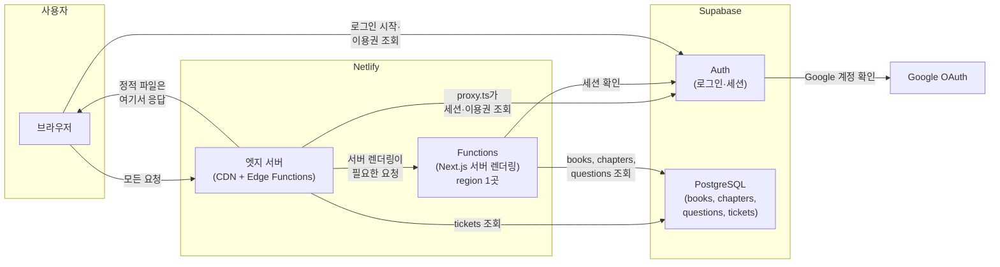
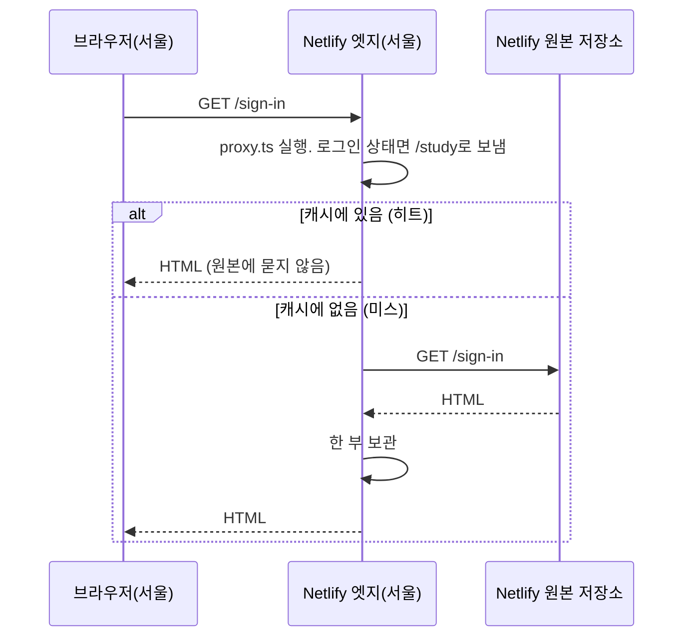
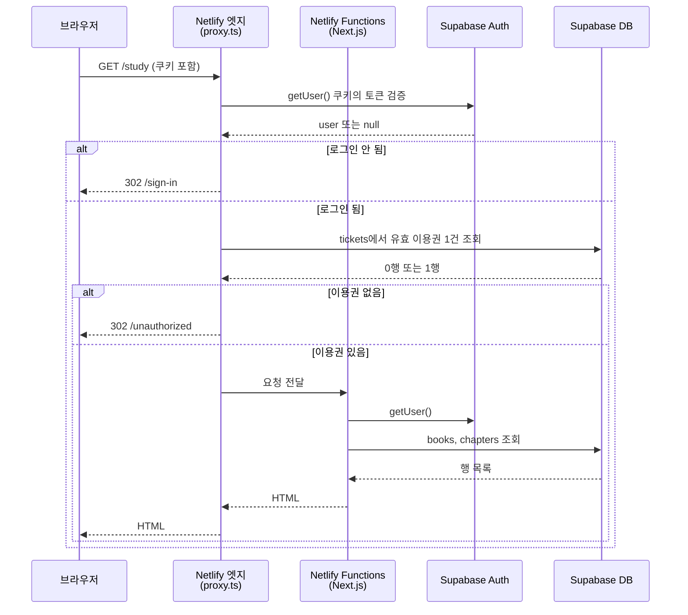
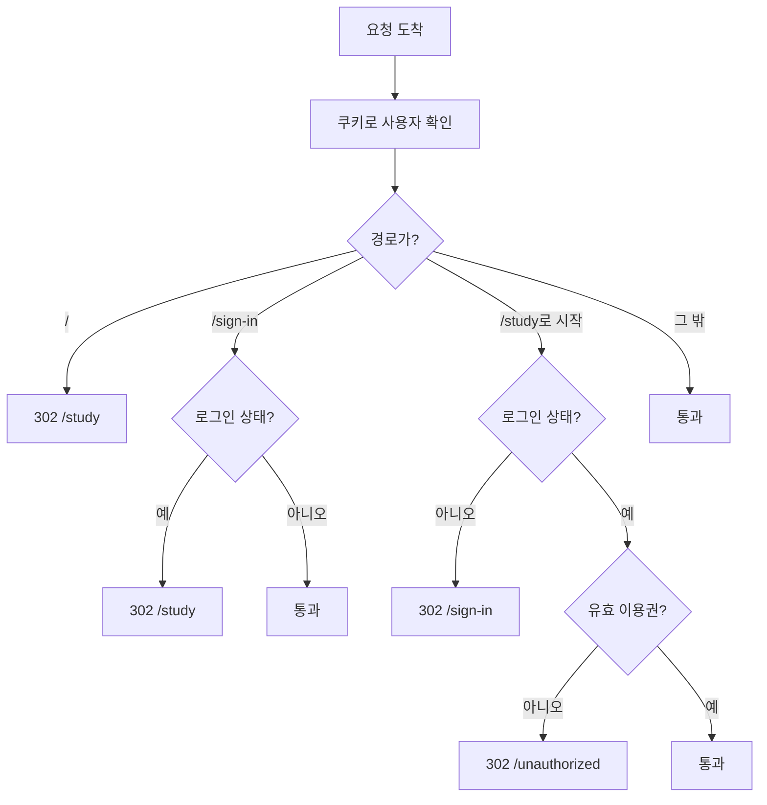
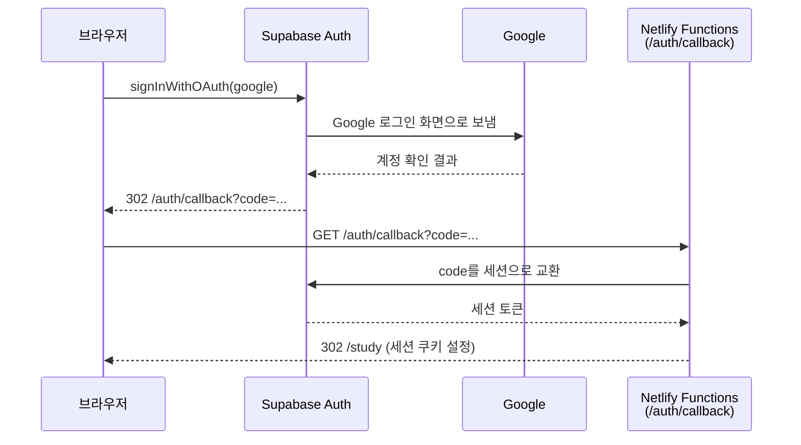
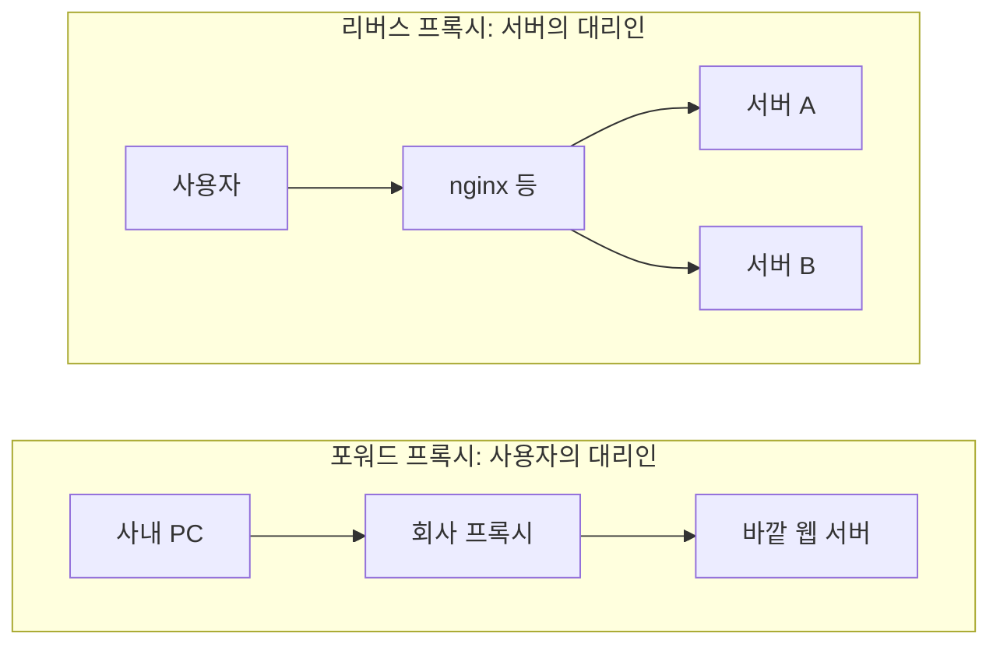
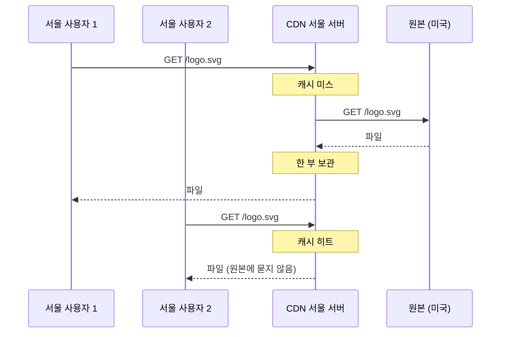
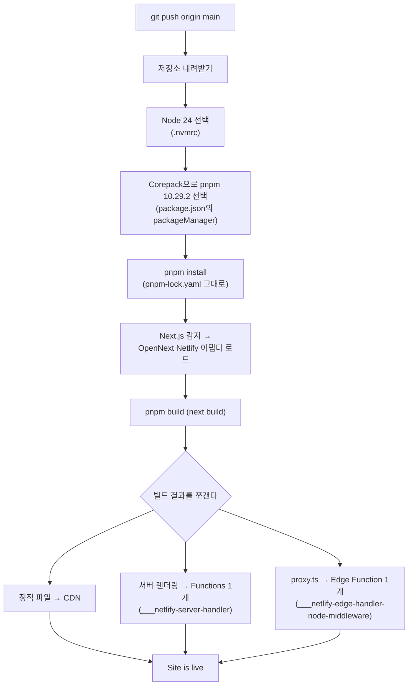
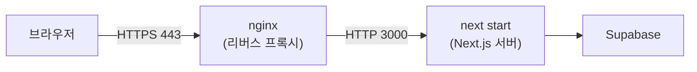

# 배포 구조와 서버 개념

이 문서는 aispeechfit이 어떤 부품으로 이루어져 있고, 사용자의 요청이 어느 길을 지나 답을 받는지 적는다. 그 길에 나오는 서버 개념(프록시, 리버스 프록시, CDN, 엣지, 서버리스 함수)도 이 앱을 예로 풀어 적는다. 프로덕트 동작에 영향을 주는 설정은 없고, 읽어서 구조를 익히는 문서다. 데이터 접근 범위는 [SECURITY.md](./SECURITY.md)가, DB 변경 절차는 [DB-OPERATIONS.md](./DB-OPERATIONS.md)가 다룬다.

## 1. 한 장으로 보는 구성

이 앱은 코드 저장소 하나, 호스팅 하나(Netlify), 백엔드 하나(Supabase)로 이루어진다. 별도의 API 서버는 없다. 서버에서 해야 할 일은 Next.js가 하고, 데이터와 로그인은 Supabase가 맡는다.

| 부품 | 무엇인가 | 이 앱에서 하는 일 |
| --- | --- | --- |
| 브라우저 | 사용자의 기기 | 화면을 그리고, 로그인 시작과 `/unauthorized` 화면의 이용권 조회는 브라우저가 Supabase에 직접 요청한다 |
| Netlify 엣지 서버 | 세계 곳곳에 있는 Netlify의 서버. CDN 캐시와 Edge Functions가 여기서 돈다 | 모든 요청을 가장 먼저 받는다. 정적 파일은 캐시에서 바로 주고, `proxy.ts`를 실행해 로그인·이용권을 검사한다 |
| Netlify Functions | 요청이 올 때만 깨어나는 Node.js 함수. region 1곳에서 돈다 | `/study`와 챕터 화면처럼 사용자마다 다른 HTML을 만든다 |
| Supabase Auth | 로그인과 세션 발급 | Google 로그인을 중계하고 사용자 토큰을 쿠키로 준다 |
| Supabase PostgreSQL | 데이터베이스 | 학습 자료 3개 테이블과 이용권 테이블. 접근 범위는 RLS가 정한다 |

## 2. 빌드가 만드는 두 종류의 결과물

`pnpm build`(`next build`)를 돌리면 Next.js가 페이지마다 "미리 만들어 둘 수 있는가"를 판정한다. 2026. 09. 12. 배포 로그의 결과다.

| 표시 | 경로 | 뜻 | 어디서 응답하는가 |
| --- | --- | --- | --- |
| ○ 정적 | `/`, `/_not-found`, `/sign-in`, `/test-browser`, `/unauthorized` | 누가 요청해도 HTML이 같아서 빌드 때 파일로 만들어 둔다 | 엣지 서버의 CDN 캐시 |
| ƒ 동적 | `/auth/callback`, `/study`, `/study/books/[bookId]/chapters/[chapterId]` | 요청한 사용자에 따라 내용이 달라서 요청마다 만든다 | Functions |
| ƒ Proxy | `proxy.ts` | 페이지에 닿기 전에 실행되는 검사 코드 | 엣지 서버의 Edge Function |

JS·CSS 파일(`/_next/static/...`)도 정적이다. 파일 이름에 내용의 해시가 붙으므로 내용이 바뀌면 이름도 바뀐다. 그래서 CDN에 오래 두어도 낡은 파일을 줄 일이 없다.

이 구분이 이 문서 전체의 뼈대다. **복사해 둘 수 있는 것은 CDN이 나르고, 복사할 수 없는 것은 한 곳(Functions)에서 만든다.**

## 3. 요청이 지나는 길

### 3-1. 정적 페이지: `/sign-in`

`proxy.ts`의 matcher는 `/_next/static`, `/_next/image`, 이미지 파일을 제외한다. 그래서 JS·CSS·이미지 요청은 검사 없이 캐시에서 바로 나간다.

### 3-2. 서버 렌더링 페이지: `/study`

검사가 엣지에서 먼저 돌기 때문에, 로그인하지 않은 요청은 Functions까지 가지 않고 사용자 가까이에서 돌아간다. Functions는 검사를 통과한 요청만 받는다.

### 3-3. `proxy.ts`의 판정

`proxy.ts`는 `utils/supabase/middleware.ts`의 `updateSession`을 부른다. 경로에 따라 이렇게 갈린다.

이 검사는 화면 이동만 담당한다. 검사를 우회해 Supabase에 직접 요청해도 데이터가 새지 않도록 하는 것은 DB의 RLS다([SECURITY.md](./SECURITY.md)).

### 3-4. 로그인

`/auth/callback`은 서버에서 코드를 세션으로 바꿔야 하므로 동적이다. 그 뒤로는 쿠키의 토큰을 매 요청에 실어 보내고, `proxy.ts`와 페이지가 그 토큰으로 사용자를 확인한다.

## 4. 서버 개념

### 4-1. 프록시: 대신 요청하는 서버

프록시는 대리인이다. 요청하는 쪽과 답하는 쪽 사이에 끼어 요청을 대신 받는다. 누구의 대리인이냐로 둘로 갈린다.

| 종류 | 누구 편인가 | 무엇을 숨기는가 | 예 |
| --- | --- | --- | --- |
| 포워드 프록시 | 사용자 | 사용자. 바깥 서버는 프록시만 본다 | 회사 방화벽, VPN |
| 리버스 프록시 | 서버 | 서버. 사용자는 프록시만 보고 뒤에 서버가 몇 대인지 모른다 | nginx, Caddy, 로드 밸런서 |

리버스 프록시가 서버 앞에 서면 할 수 있는 일이 늘어난다.

| 하는 일 | 뜻 |
| --- | --- |
| 나눠 주기 | 서버가 여러 대면 요청을 돌아가며 넘긴다(로드 밸런싱) |
| 암호 풀기 | HTTPS를 여기서 풀고 뒤로는 평문으로 넘긴다. 인증서를 한 곳에서 관리한다 |
| 길 안내 | `/api`는 A 서버로, `/`는 B 서버로 보낸다 |
| 기억하기 | 같은 응답을 보관했다가 원본에 묻지 않고 준다(캐시) |
| 막기 | 이상한 요청을 서버에 닿기 전에 버린다 |

### 4-2. CDN: 캐시를 가진 리버스 프록시를 세계 곳곳에 둔 것

서버가 미국에 1대 있고 사용자가 서울에 있으면, 요청마다 태평양을 왕복한다. 로고 이미지처럼 누가 요청해도 같은 파일을 그 먼 곳에서 매번 받아 올 이유가 없다.

CDN은 리버스 프록시에 캐시를 붙이고, 그것을 서울·도쿄·싱가포르·프랑크푸르트 등 수백 곳에 놓은 것이다. 서울 사용자의 요청은 서울 서버가 받는다.

CDN이 주는 것은 3가지다. 가까운 곳에서 받으니 빠르고, 원본은 한 번만 내주면 되니 부담이 줄고, 요청이 폭주해도 수백 곳이 나눠 받는다.

CDN이 못 하는 것은 사람마다 다른 응답이다. `/study`는 로그인한 사용자의 이용권을 보고 그 사람의 책 목록을 그린다. 이 응답은 보관해 둘 수 없으므로 Functions가 매번 만든다.

보관한 복사본이 낡는 문제는 두 방법으로 막는다. 파일마다 유효 기간을 붙이거나(캐시 헤더), 배포할 때 CDN에 버리라고 알린다(무효화). Next.js는 JS·CSS 파일 이름에 내용 해시를 붙여서, 내용이 바뀌면 이름이 바뀌어 옛 복사본을 아무도 요청하지 않게 한다.

### 4-3. 엣지와 서버리스 함수

| 이름 | 무엇인가 | 이 앱에서 |
| --- | --- | --- |
| 엣지(Edge) | CDN 서버가 있는 자리. 사용자와 가장 가까운 곳 | Netlify 엣지 서버 |
| Edge Function | 엣지 서버에서 실행되는 짧은 코드. 요청이 원본에 가기 전에 검사·수정한다 | `proxy.ts` |
| 서버리스 함수(Serverless Function) | 오래 도는 서버 없이, 요청이 올 때만 깨어나 답하고 잠드는 코드. region 1곳에서 돈다 | Netlify Functions가 Next.js 서버 렌더링을 담당 |

"서버리스"는 서버가 없다는 뜻이 아니라, 서버를 직접 띄우고 관리하지 않는다는 뜻이다. 대신 오래 도는 프로세스가 없어서 메모리에 상태를 들고 있을 수 없고, 첫 요청은 깨어나는 시간(cold start)이 든다.

## 5. Netlify 빌드·배포 파이프라인

`main`에 푸시하면 Netlify가 다음 순서로 일한다. 2026. 09. 12. 배포 로그를 옮긴 것이다.

빌드 결과를 쪼개는 일을 하는 것이 어댑터다. Next.js 15부터 이 규칙이 공개 인터페이스(Build Adapters API)로 열렸고, OpenNext 프로젝트가 Netlify·Cloudflare·AWS용 어댑터를 만든다. 그 전에는 규칙이 Vercel 안에만 있어서 다른 호스팅이 흉내 내야 했다. "Next.js는 Vercel에 의존한다"는 말은 이 시절의 이야기다.

## 6. 같은 앱을 다른 곳에 배포하면

| 환경 | 서버 렌더링을 누가 하는가 | 필요한 것 | Next.js 기능 |
| --- | --- | --- | --- |
| Netlify (현재) | Functions | 어댑터. Netlify가 자동으로 붙인다 | 문서상 제약 6가지가 있으나 이 앱은 해당 없음 |
| Vercel | Vercel Functions | 없음. Next.js와 같은 회사 | 제약 없음 |
| Cloudflare, AWS | Workers, Lambda | OpenNext 어댑터 | 어댑터마다 다름 |
| 온프레미스, Docker, VM | `next start`가 띄운 Node.js 서버 1개 | 어댑터 불필요. 앞에 리버스 프록시(nginx)를 둔다 | 제약 없음. Next.js 자체가 서버다 |

온프레미스는 서버를 통째로 띄울 수 있으므로 쪼갤 필요가 없고, 어댑터 문제와 처음부터 무관하다.

온프레미스에서 신경 쓸 것은 2가지다. 서버를 여러 대 띄우면 ISR·fetch 캐시가 각 서버의 `.next/cache`에 따로 쌓이므로 `cacheHandler`로 Redis 같은 공유 저장소를 꽂아야 하고, Docker로 띄우면 `output: 'standalone'`으로 실행에 필요한 파일만 모은다.

## 7. Region

이 앱에서 region이 있는 부품은 Netlify Functions와 Supabase 프로젝트 2곳이다. 나머지는 region이 없다.

| 부품 | region | 어디서 보는가 |
| --- | --- | --- |
| CDN (정적 파일) | 없음. 세계 곳곳에 복제된다 | 해당 없음 |
| Edge Function (`proxy.ts`) | 없음. 사용자 가까운 엣지에서 돈다 | 해당 없음 |
| Netlify Functions | 1곳. 2023. 10. 04. 이후 만든 사이트의 기본값은 `cmh`(미국 오하이오) | Netlify: Project configuration → Build & deploy → Continuous deployment → Functions region. Pro 이상 요금제에서 바꿀 수 있다 |
| Supabase 프로젝트 | 1곳 | Supabase: Project Settings → General |

서버 렌더링마다 Functions가 Supabase에 질의하므로, 둘을 같은 region에 두는 것이 사용자와 가까운 region을 고르는 것보다 먼저다. `proxy.ts`도 엣지에서 Supabase에 질의하므로, 엣지가 사용자 가까이 있어도 그 질의는 Supabase region까지 왕복한다.

## 8. 용어

| 용어 | 뜻 |
| --- | --- |
| 원본(origin) | 파일이나 응답을 처음 만드는 서버. CDN이 캐시 미스일 때 묻는 곳 |
| 캐시 히트 / 미스 | 보관한 복사본이 있어 바로 주는 것 / 없어서 원본에 묻는 것 |
| 무효화(invalidation) | 보관한 복사본을 버리라고 CDN에 알리는 것 |
| 정적(static) | 빌드 때 만들어 두는 파일. 누가 요청해도 같다 |
| 동적(dynamic) / 서버 렌더링(SSR) | 요청마다 서버가 만드는 HTML. 사용자에 따라 다르다 |
| ISR | 정적 페이지를 일정 시간마다 다시 만드는 방식. 이 앱은 쓰지 않는다 |
| cold start | 서버리스 함수가 잠들어 있다가 첫 요청에 깨어나는 시간 |
| 어댑터(adapter) | Next.js 빌드 결과를 특정 호스팅의 함수·CDN 구조로 쪼개 배치하는 도구 |
| TLS 종료 | HTTPS 암호를 리버스 프록시에서 풀고 뒤로는 평문으로 넘기는 것 |
